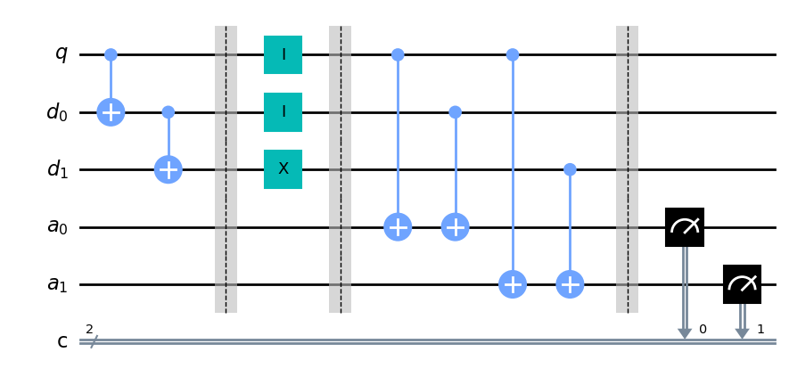
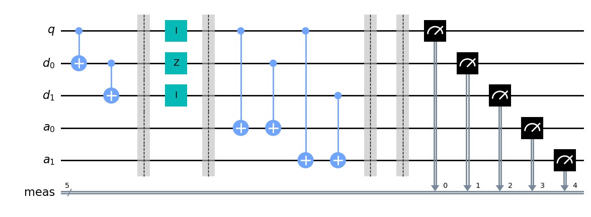

# 3-QUBIT CODE

Basic introduction to the concepts of quantum error correction. It does not represent a full quantum code however.

The 3-qubit code, denoted with the notation $[[3, 1, 3]]$, has a quantum code distance $d = 3$; and encodes a single logical qubit into three physical qubits with the property that it can detect at most $r = (d - 1) = 2$ errors and correct for a single $\sigma_x$ bit-flip error i.e. at most $t = (d - 1)/2 = 1$ errors.

It maps an arbitrary single qubit state $|\psi\rangle = \alpha|0\rangle + \beta|1\rangle$ into:
$$\alpha|0\rangle + \beta|1\rangle \rightarrow \alpha|0\rangle_L + \beta|1\rangle_L\\
= \alpha|000\rangle + \beta|111\rangle\\
= |\psi\rangle_L
$$

Two additional ancilla qubits are introduced which are used to extract syndrome infromation without directly measuring the state of the data qubits.

### Assumptions
- all gate operations are perfect
- qubits are only susceptible to errors in the region between encoding and correction


```python
# Importing standard Qiskit libraries
from qiskit import QuantumCircuit, transpile, QuantumRegister, ClassicalRegister
from qiskit.tools.jupyter import *
from qiskit.visualization import *
from ibm_quantum_widgets import *

from qiskit.result import Counts
from qiskit.quantum_info import Statevector
from qiskit.providers.aer import QasmSimulator, StatevectorSimulator

# qiskit-ibmq-provider has been deprecated.
# Please see the Migration Guides in https://ibm.biz/provider_migration_guide for more detail.
from qiskit_ibm_runtime import QiskitRuntimeService, Sampler, Estimator, Session, Options

# Loading your IBM Quantum account(s)
service = QiskitRuntimeService(channel="ibm_quantum")

# Invoke a primitive. For more details see https://qiskit.org/documentation/partners/qiskit_ibm_runtime/tutorials.html
# result = Sampler("ibmq_qasm_simulator").run(circuits).result()
```


```python
qsim = QasmSimulator()
vsim = StatevectorSimulator()
```

## Error Detection and Correction


```python
from IPython.display import Markdown as md
from enum import Enum

class ErrorSims(Enum):
    NoError = 0
    XError1 = 1
    XError2 = 2
    XError3 = 3
    XError12 = 4
    XError13 = 5
    XError23 = 6
    ZError1 = 7
    ZError2 = 8
    YError1 = 9
    YError2 = 10

def qcirc(i: ErrorSims, measure_all: bool = False) -> QuantumCircuit:
    q = QuantumRegister(1, 'q') # data qubit
    d = QuantumRegister(2, 'd') # redundancy qubits
    a = QuantumRegister(2, 'a') # ancilla qubits
    
    if not measure_all:
        # classical bits
        c = ClassicalRegister(2, 'c')
        qc = QuantumCircuit(q, d, a, c)
    else:
        qc = QuantumCircuit(q, d, a)

    # redundancy
    qc.cx(q, d[0])
    qc.cx(d[0], d[1])
    qc.barrier()
    
    match i:
        case ErrorSims.NoError:
            qc.i(q); qc.i(d[0]); qc.i(d[1]);
        case ErrorSims.XError1:
            qc.x(q); qc.i(d[0]); qc.i(d[1]);
        case ErrorSims.XError2:
            qc.i(q); qc.x(d[0]); qc.i(d[1]);
        case ErrorSims.XError3:
            qc.i(q); qc.i(d[0]); qc.x(d[1]);
        case ErrorSims.XError12:
            qc.x(q); qc.x(d[0]); qc.i(d[1]);
        case ErrorSims.XError13:
            qc.x(q); qc.i(d[0]); qc.x(d[1]);
        case ErrorSims.XError23:
            qc.i(q); qc.x(d[0]); qc.x(d[1]);
        case ErrorSims.ZError1:
            qc.z(q); qc.i(d[0]); qc.i(d[1]);
        case ErrorSims.ZError2:
            qc.i(q); qc.z(d[0]); qc.i(d[1]);
        case ErrorSims.YError1:
            qc.y(q); qc.i(d[0]); qc.i(d[1]);
        case ErrorSims.YError2:
            qc.i(q); qc.y(d[0]); qc.i(d[1]);
            
    qc.barrier()

    # party check
    qc.cx(q, a[0])
    qc.cx(d[0], a[0])
    qc.cx(q, a[1])
    qc.cx(d[1], a[1])
    qc.barrier()

    qc.measure_all() if measure_all else qc.measure([a[0], a[1]], [c[0], c[1]])
    return qc
```


```python
def qcirc_sim(qc: QuantumCircuit) -> Counts:
    job = qsim.run(qc, shots=1024)
    result = job.result()
    counts = result.get_counts()
    return counts
```


```python
def counts_bit_reversed(counts: str) -> dict:
    a = {}
    for b in counts:
        a[''.join( [i for i in list(counts.keys())[0] ][::-1] )] = counts[b]
    return a
```

### 1. No Errors

When there are no errors, the final state i.e. data and ancilla qubits is: $\alpha|000\rangle|00\rangle + \beta|111\rangle|00\rangle$. No detected errors, therefore no need for correction


```python
qc = qcirc(ErrorSims.NoError)
qc.draw()
```


    

    


```python
counts: Counts = qcirc_sim(qc)
print(counts)
syndrome = list(counts_bit_reversed(counts).keys())[0]

md("""Ancilla qubits is in the state $|{}\\rangle$. No errors
 detected hence no correction needed""".format( syndrome ))

```

    {'00': 1024}


Ancilla qubits is in the state $|00\rangle$. No errors
 detected hence no correction needed


### 2. Bit-flip Error on qubit 1

Syndrome information is $|11\rangle$ indicating an error on qubit 1. $\sigma_x$ correction is applied to qubit 1


```python
qc = qcirc(ErrorSims.XError1)
qc.draw()
```


    

    


```python
counts: Counts = qcirc_sim(qc)
print(counts)
syndrome = list(counts_bit_reversed(counts).keys())[0]

md("""Ancilla qubits is in the state $|{}\\rangle$. Bit-flip error 
detected on qubit 1 and a $\sigma_x$ operation is performed on qubit 1 for correction""".format( syndrome ))
```

    {'11': 1024}


Ancilla qubits is in the state $|11\rangle$. Bit-flip error 
detected on qubit 1 and a $\sigma_x$ operation is performed on qubit 1 for correction


### Bit-flip Error on qubit 2


```python
qc = qcirc(ErrorSims.XError2)
qc.draw()
```


    

    


```python
counts: Counts = qcirc_sim(qc)
print(counts)
syndrome = list(counts_bit_reversed(counts).keys())[0]

md("""Ancilla qubits is in the state $|{}\\rangle$. Bit-flip error 
detected on qubit 2 and a $\sigma_x$ operation is performed on qubit 2 for correction""".format( syndrome ))
```

    {'01': 1024}


Ancilla qubits is in the state $|10\rangle$. Bit-flip error 
detected on qubit 2 and a $\sigma_x$ operation is performed on qubit 2 for correction


### Bit-flip Error on qubit 3


```python
qc = qcirc(ErrorSims.XError3)
qc.draw()
```


    

    


```python
counts: Counts = qcirc_sim(qc)
print(counts)
syndrome = list(counts_bit_reversed(counts).keys())[0]

md("""Ancilla qubits is in the state $|{}\\rangle$. Bit-flip error 
detected on qubit 3 and a $\sigma_x$ operation is performed on qubit 3 for correction""".format( syndrome ))
```

    {'10': 1024}


Ancilla qubits is in the state $|01\rangle$. Bit-flip error 
detected on qubit 3 and a $\sigma_x$ operation is performed on qubit 3 for correction


### Bit-flip Error on qubits 1 and 2


```python
qc = qcirc(ErrorSims.XError12)
qc.draw()
```


    

    


```python
counts: Counts = qcirc_sim(qc)
print(counts)
syndrome = list(counts_bit_reversed(counts).keys())[0]

md("""Ancilla qubits is in the state $|{}\\rangle$. Bit-flip error is 
detected on qubit 3. This however is a misdiagnosis. Correcting for it 
induces a logical bit flip, causing our code to fail.""".format( syndrome ))
```

    {'10': 1024}


Ancilla qubits is in the state $|01\rangle$. Bit-flip error is 
detected on qubit 3. This however is a misdiagnosis. Correcting for it 
induces a logical bit flip, causing our code to fail.


### Bit-flip Error on qubits 1 and 3


```python
qc = qcirc(ErrorSims.XError13)
qc.draw()
```


    

    


```python
counts: Counts = qcirc_sim(qc)
print(counts)
syndrome = list(counts_bit_reversed(counts).keys())[0]

md("""Ancilla qubits is in the state $|{}\\rangle$. Bit-flip error is 
detected on qubit 2. This however is a misdiagnosis. Correcting for it 
induces a logical bit flip, causing our code to fail.""".format( syndrome ))
```

    {'01': 1024}


Ancilla qubits is in the state $|10\rangle$. Bit-flip error is 
detected on qubit 2. This however is a misdiagnosis. Correcting for it 
induces a logical bit flip, causing our code to fail.


### Bit-flip Error on qubits 2 and 3


```python
qc = qcirc(ErrorSims.XError23)
qc.draw()
```


    

    


```python
counts: Counts = qcirc_sim(qc)
print(counts)
syndrome = list(counts_bit_reversed(counts).keys())[0]

md("""Ancilla qubits is in the state $|{}\\rangle$. Bit-flip error is 
detected on qubit 1. This however is a misdiagnosis. Correcting for it 
induces a logical bit flip, causing our code to fail.""".format( syndrome ))
```

    {'11': 1024}


Ancilla qubits is in the state $|11\rangle$. Bit-flip error is 
detected on qubit 1. This however is a misdiagnosis. Correcting for it 
induces a logical bit flip, causing our code to fail.


### Z Error on qubits 1


```python
qc = qcirc(ErrorSims.ZError1, True)
qc.draw()
```


    

    


```python

counts: Counts = qcirc_sim(qc)
print(counts)
syndrome = list(counts_bit_reversed(counts).keys())[0]

md("""Ancilla qubits is in the state $|{}\\rangle$. No errors
 detected even though technically there is a phase change error""".format( syndrome ))
```

    {'00000': 1024}


Ancilla qubits is in the state $|00000\rangle$. No errors
 detected even though technically there is a phase change error


### Z Error on qubits 2


```python
qc = qcirc(ErrorSims.ZError2, True)
qc.draw()
```


    

    


```python
counts: Counts = qcirc_sim(qc)
print(counts)
syndrome = list(counts_bit_reversed(counts).keys())[0]

md("""Ancilla qubits is in the state $|{}\\rangle$. No errors
 detected even though technically there is a phase change error""".format( syndrome ))
```

    {'00000': 1024}


Ancilla qubits is in the state $|00000\rangle$. No errors
 detected even though technically there is a phase change error


### Y Error on qubits 1


```python
qc = qcirc(ErrorSims.YError1, True)
qc.draw()
```


    

    


```python
counts: Counts = qcirc_sim(qc)
print(counts)
syndrome = list(counts_bit_reversed(counts).keys())[0]

md("""Ancilla qubits is in the state $|{}\\rangle$. Only detected the bit-flip error 
on qubit 1 but not the phase flip error""".format( syndrome ))
```

    {'11001': 1024}


Ancilla qubits is in the state $|10011\rangle$. Only detected the bit-flip error 
on qubit 1 but not the phase flip error


### Y Error on qubits 2


```python
qc = qcirc(ErrorSims.YError2, True)
qc.draw()
```


    

    


```python
counts: Counts = qcirc_sim(qc)
print(counts)
syndrome = list(counts_bit_reversed(counts).keys())[0]

md("""Ancilla qubits is in the state $|{}\\rangle$. Only detected the bit-flip error 
on qubit 2 but not the phase flip error""".format( syndrome ))
```

    {'01010': 1024}


Ancilla qubits is in the state $|01010\rangle$. Only detected the bit-flip error 
on qubit 2 but not the phase flip error


## Summary

|Detected Error Location |Final Data State -> $|Data\rangle$ Qubits |$|Ancilla\rangle$ Qubits |Circuit Correction |Diagnostic Accuracy|
|--- |--- |--- |--- |--- |
|No Error |$\Big(\alpha|000\rangle+\beta|111\rangle\Big)|00\rangle$ |$|00\rangle$ |None |&#9745; |
|$\sigma_x$ on Qubit 1 |$\Big(\alpha|100\rangle+\beta|011\rangle\Big)|11\rangle$ |$|11\rangle$ |$\sigma_x$ on Qubit 1 |&#9745; |
|$\sigma_x$ on Qubit 2 |$\Big(\alpha|010\rangle+\beta|101\rangle\Big)|10\rangle$ |$|10\rangle$ |$\sigma_x$ on Qubit 2 |&#9745; |
|$\sigma_x$ on Qubit 3 |$\Big(\alpha|001\rangle+\beta|110\rangle\Big)|01\rangle$ |$|01\rangle$ |$\sigma_x$ on Qubit 3 |&#9745; |
|$\sigma_x$ on Qubit 1 & 2 |$\Big(\alpha|110\rangle+\beta|001\rangle\Big)|01\rangle$ |$|01\rangle$ |$\sigma_x$ on Qubit 3 |&#9746; |
|$\sigma_x$ on Qubit 1 & 3 |$\Big(\alpha|101\rangle+\beta|010\rangle\Big)|10\rangle$ |$|10\rangle$ |$\sigma_x$ on Qubit 2 |&#9746; |
|$\sigma_x$ on Qubit 2 & 3 |$\Big(\alpha|011\rangle+\beta|100\rangle\Big)|11\rangle$ |$|11\rangle$ |$\sigma_x$ on Qubit 1 |&#9746; |
|$\sigma_x$ on Qubit 1 & 2 & 3 |$\Big(\alpha|111\rangle+\beta|000\rangle\Big)|00\rangle$ |$|00\rangle$ |None |&#9746; |
|$\sigma_z$ on Qubit 1 |$\Big(\alpha|000\rangle+\beta|111\rangle\Big)|00\rangle$ |$|00\rangle$ |None |&#9746; |
|$\sigma_z$ on Qubit 2 |$\Big(\alpha|000\rangle+\beta|111\rangle\Big)|00\rangle$ |$|00\rangle$ |None |&#9746; |
|$\sigma_z$ on Qubit 3 |$\Big(\alpha|000\rangle+\beta|111\rangle\Big)|00\rangle$ |$|00\rangle$ |None |&#9746; |
|$\sigma_y$ on Qubit 1 |$\Big(\alpha|100\rangle+\beta|011\rangle\Big)|11\rangle$ |$|11\rangle$ |$\sigma_x$ on Qubit 1 |&#9746; |
|$\sigma_y$ on Qubit 2 |$\Big(\alpha|010\rangle+\beta|101\rangle\Big)|10\rangle$ |$|10\rangle$ |$\sigma_x$ on Qubit 2 |&#9746; |
|$\sigma_y$ on Qubit 3 |$\Big(\alpha|001\rangle+\beta|110\rangle\Big)|01\rangle$ |$|01\rangle$ |$\sigma_x$ on Qubit 3 |&#9746; |

---

3-qubit code:
- can only detect $r = 2$ errors at most. There is ambiguity o syndrome results when multiple errors occur.
- can only correct $t = 1$ errors at most. In every vase where $t > 1$, there is a mis-correction.
- can only detect and correct for bit-flip errors


```python

```
